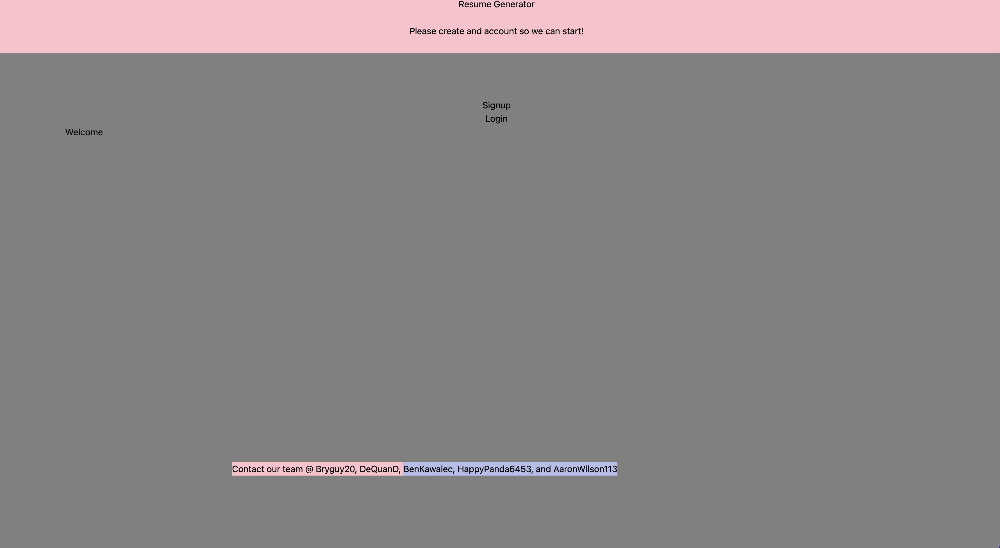

# Resume-builder

  ## Table-of-Contents
  * [Description](#description)
  * [Installation](#installation)
  * [Usage](#usage)
  
    *[License](#license)
    
  * [Contributing](#contributing)
  * [Tests](#tests)
  * [Questions](#questions)
  
  ## Description
  This application where the user can use to get a employer ready resume up to date and would not have any problem and it's all working. the user can login or sign up and would be taken to the application and get started.

  ## [authors](#table-of-contents)
  none

  ## [Usage](#table-of-contents)
  here is the link of the deployed link: https://resume-generate.herokuapp.com/

  
  the screenshot:
  

  ## Contributing

   
      Thank you for your interest in helping out; however, I will not be accepting contributions from third parties.
      
  ## [Techologies used](#table-of-contents)
   @apollo/Client.

   Use React for the template.

   Use of MongoDB and mongoose for the back-end.

   The uses of Tailwind for the styling.

   also be delpoyed with Heroku.

  ##  [Questions](#table-of-contents)
  Please contact me using the following links:
  [GitHub](https://github.com/Bryguy20, DeQuanD, BenKawalec, HappyPanda6453, and AaronWilson113)
  [Email: none](mailto:none)
